# 🛍️ Diwali Sales Analysis using Python


---

# 📖 Overview

This project performs **Exploratory Data Analysis (EDA)** on a Diwali Sales dataset using Python. The objective is to understand customer purchasing behavior during the Diwali festival and generate business insights using data visualization techniques. The project helps identify high-value customer segments, top-performing states, occupations, and product categories to support better business decisions.

---

# 🎯 Business Objective

The objective of this project is to answer key business questions such as:

- Which gender contributes the highest sales?
- Which age group spends the most?
- Which states generate the highest revenue?
- Which occupations have the highest purchasing power?
- Which product categories are the most popular?

---

# 📂 Dataset

- 📄 **Dataset:** [Diwali_Sales_Data.csv](Diwali_Sales_Data.csv)
- 📓 **Jupyter Notebook:** [Diwali_sales.ipynb](Diwali_sales.ipynb)

---

# 🛠️ Technologies Used

- 🐍 Python
- 📊 Pandas
- 🔢 NumPy
- 📈 Matplotlib
- 📉 Seaborn
- 📓 Jupyter Notebook

---

# 🎯 Skills Demonstrated

- Data Cleaning
- Handling Missing Values
- Exploratory Data Analysis (EDA)
- Data Visualization
- Customer Segmentation
- Business Insights
- Python Programming
- Pandas
- NumPy
- Matplotlib
- Seaborn

---

# 📊 Business Questions & Analysis

---

# 👥 Customer Demographics Analysis

## ❓ Business Question

**Which gender contributes the highest sales during the Diwali festival?**

### 🎯 Objective

Analyze customer distribution and sales by gender to identify the primary customer segment.

### 📈 Customer Distribution

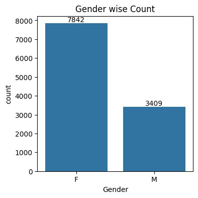

### 📈 Sales Amount by Gender

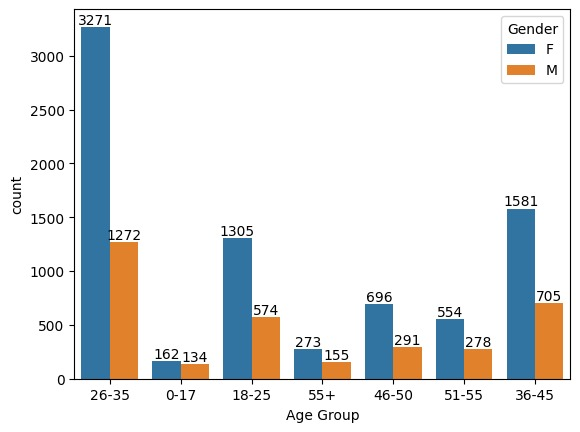

### 🔍 Key Insights

- Female customers represent a larger share of the customer base.
- Female customers generated significantly higher sales than male customers.
- Women were the dominant customer segment during the Diwali shopping season.

### 💡 Business Recommendation

- Launch targeted festive campaigns for female customers.
- Expand product offerings preferred by women.
- Introduce loyalty programs to improve customer retention.

---

# 🎂 Age Group Analysis

## ❓ Business Question

**Which age group contributes the highest sales during Diwali?**

### 🎯 Objective

Analyze customer purchasing behavior across different age groups.

### 📈 Customer Distribution


### 📈 Sales Amount by Age Group

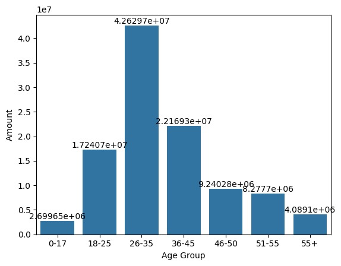

### 🔍 Key Insights

- Customers aged **26–35 years** generated the highest sales.
- Young adults were the most active shoppers.
- This age group represents the highest-value customer segment.

### 💡 Business Recommendation

- Focus festive marketing campaigns on customers aged 26–35 years.
- Offer personalized discounts and product recommendations.

---

# 💍 Marital Status Analysis

## ❓ Business Question

**How does marital status influence customer purchasing behavior?**

### 🎯 Objective

Understand the impact of marital status on shopping patterns.

### 📈 Customer Distribution

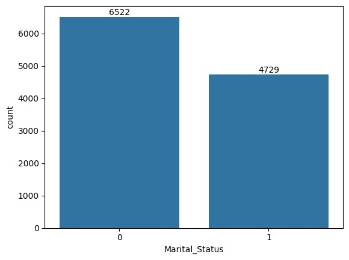

### 📈 Sales Amount

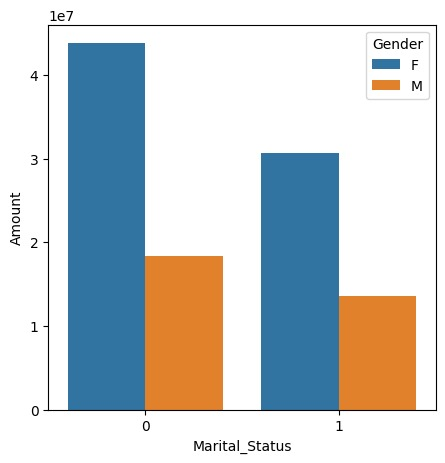

### 🔍 Key Insights

- Married customers contributed a larger share of total sales.
- Married female customers generated the highest revenue.

### 💡 Business Recommendation

- Create family-oriented festive offers.
- Introduce bundled product promotions for households.

---

# 🗺️ State-wise Sales Analysis

## ❓ Business Question

**Which states generate the highest sales and order volume?**

### 🎯 Objective

Identify top-performing states to improve regional marketing strategies.

### 📈 Orders by State

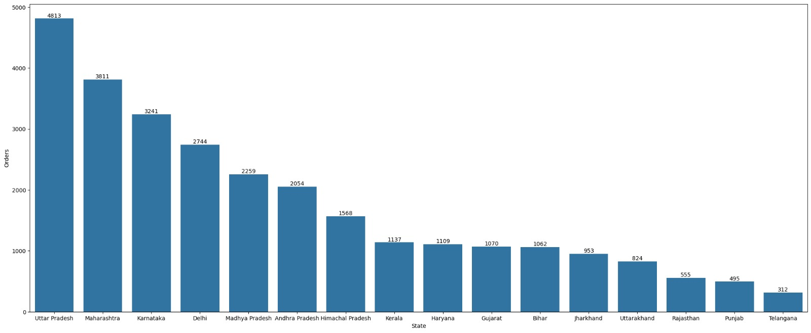

### 📈 Sales Amount by State

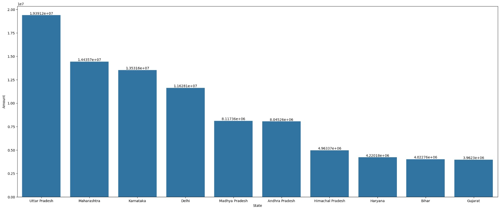

### 🔍 Key Insights

- Uttar Pradesh generated the highest sales and order count.
- Maharashtra and Karnataka also contributed significantly.
- Sales were concentrated in a few major states.

### 💡 Business Recommendation

- Increase inventory in high-demand states.
- Launch region-specific festive campaigns.

---

# 💼 Occupation Analysis

## ❓ Business Question

**Which occupations have the highest purchasing power?**

### 🎯 Objective

Analyze customer occupations to identify high-value customer groups.

### 📈 Customer Distribution

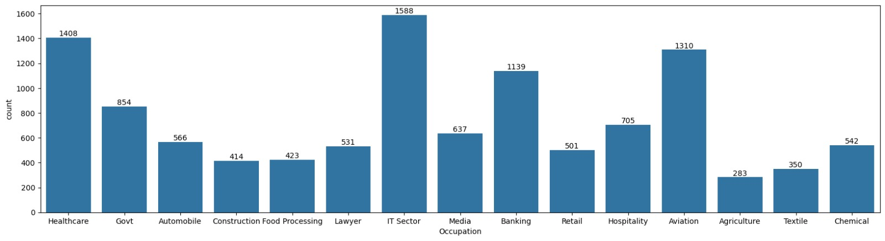

### 📈 Sales Amount

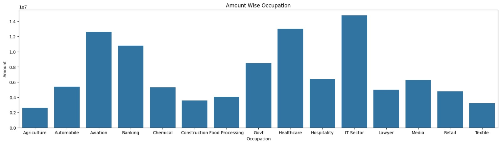

### 🔍 Key Insights

- IT, Healthcare, and Aviation professionals spent the most.
- Working professionals represented the strongest purchasing segment.

### 💡 Business Recommendation

- Develop premium festive offers for professionals.
- Partner with corporate organizations for promotional campaigns.

---

# 🛍️ Product Category Analysis

## ❓ Business Question

**Which product categories are the most popular?**

### 🎯 Objective

Identify the product categories generating the highest demand and revenue.

### 📈 Product Category Distribution

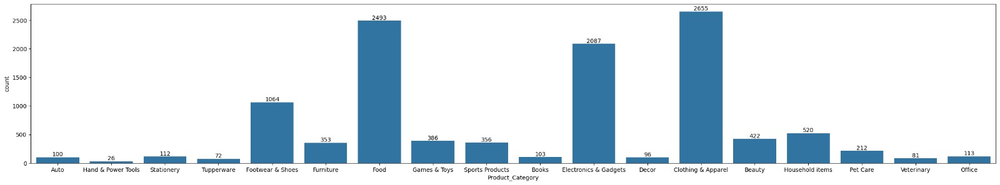

### 📈 Product Category Sales Amount

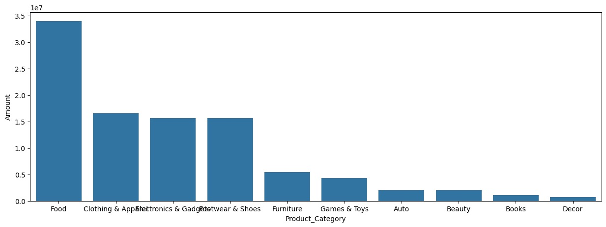

### 🔍 Key Insights

- Food generated the highest sales.
- Clothing and Electronics were also top-performing categories.
- A small number of product categories contributed most of the revenue.

### 💡 Business Recommendation

- Prioritize inventory for top-selling categories.
- Promote complementary products through cross-selling.

---

# 📌 Overall Business Insights

- Female customers generated the highest overall sales.
- Customers aged **26–35 years** were the most valuable customer segment.
- Uttar Pradesh, Maharashtra, and Karnataka generated the highest revenue.
- IT, Healthcare, and Aviation professionals demonstrated strong purchasing power.
- Food, Clothing, and Electronics were the most popular product categories.

---

# 📁 Project Structure

```text
Python-Diwali-Sales-Analysis/
│
├── Diwali_sales.ipynb
├── Diwali_Sales_Data.csv
├── requirements.txt
├── README.md
└── images/
    ├── gender_distribution.png
    ├── gender_sales_amount.png
    ├── age_group_gender_distribution.png
    ├── age_group_sales_amount.png
    ├── marital_status_distribution.png
    ├── marital_status_sales_amount.png
    ├── state_orders.png
    ├── state_sales_amount.png
    ├── occupation_distribution.png
    ├── occupation_sales_amount.png
    ├── product_category_distribution.png
    └── product_category_sales_amount.png
```

---

# ▶️ How to Run

### Clone the repository

```bash
git clone https://github.com/vinay9943/Python-Diwali-Sales-Analysis.git
```

### Install required libraries

```bash
pip install -r requirements.txt
```

### Open Jupyter Notebook

```bash
jupyter notebook
```

Run all cells in **Diwali_sales.ipynb**.

---

# 🚀 Project Outcome

The analysis identified key customer segments, high-performing states, and top-selling product categories. These insights can help businesses improve marketing strategies, optimize inventory planning, and enhance customer engagement during festive sales.

---

# 🔮 Future Improvements

- Build an interactive Power BI dashboard.
- Develop machine learning models for sales prediction.
- Deploy the project using Streamlit.

---

# 👨‍💻 Author

**Vinay Siddharudh Thisake**

📧 Email: **Vthisake2@gmail.com**

💼 LinkedIn: **https://www.linkedin.com/in/vinay-thisake-097200299**

💻 GitHub: **https://github.com/vinay9943**

---

⭐ **If you found this project useful, please consider giving it a Star!**
